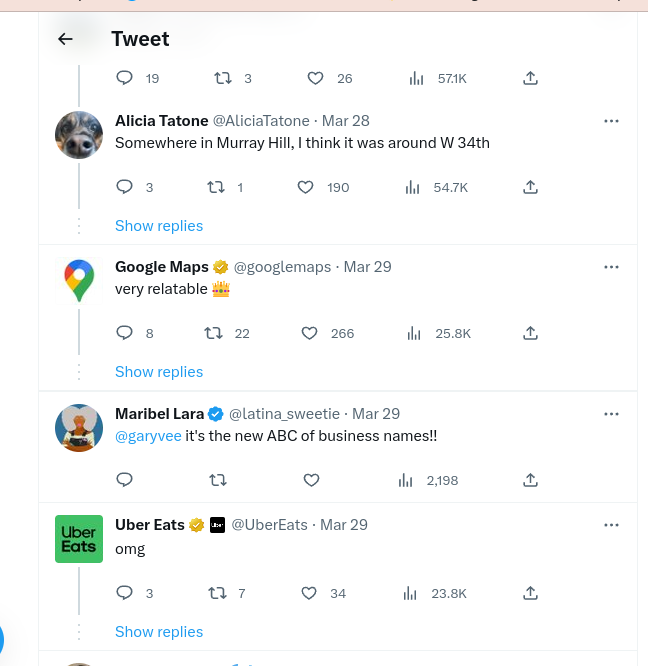
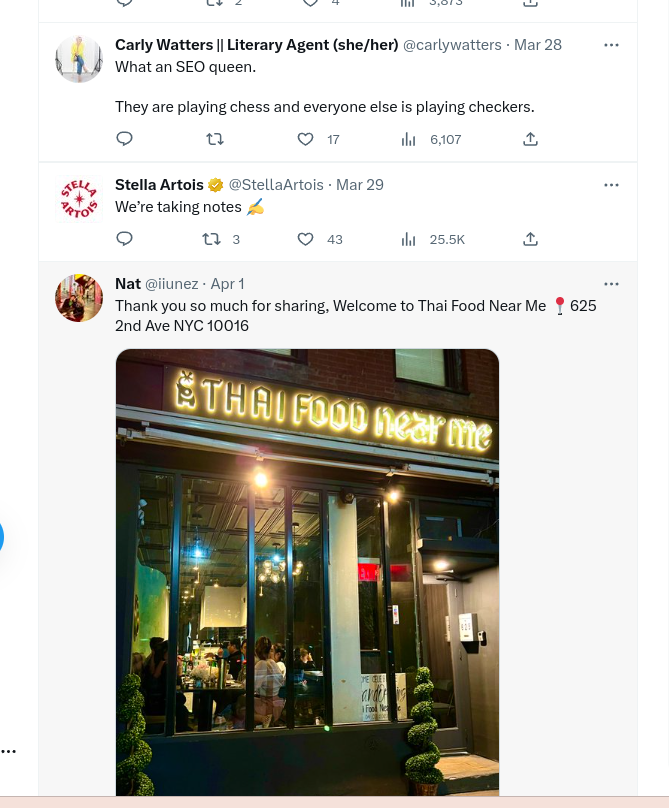
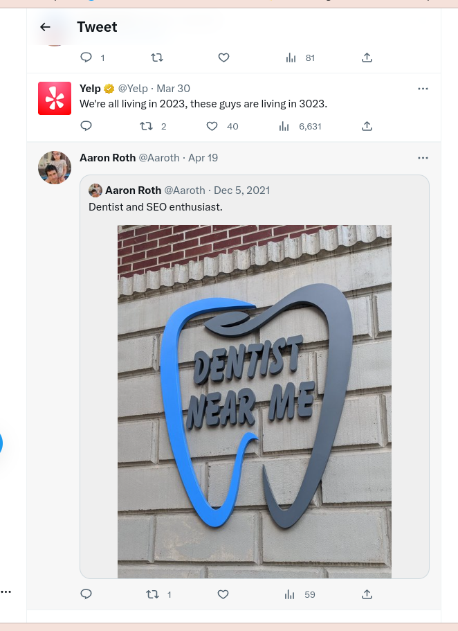


"We're all living in 2023, these guys are living in 3023.", Yelp



Local SEO Hacks


Este restaurante no está solo en la lista de personas que intentan hackear los rankings de "Local SEO", pero este tweet de @AliciaTatone hizo que este restaurante se volviera viral.



Un restaurante tailandés en la ciudad de Nueva York se ha vuelto popular en Twitter por su enfoque único de marca al llamarse "Thai Food Near Me", aprovechando los patrones de búsqueda comunes de las personas en Google.

Siendo de la ciudad de Panamá, veo restaurantes abrir y cerrar regularmente. El negocio de los restaurantes es complicado en una ciudad cosmopolita. Tiene sentido que intentes capitalizar tu clientela lo más rápido posible en este caso.

No creo que ese nombre haga un legado duradero en el sentido tradicional; si fuera así, todos estarían abriendo negocios con esta estrategia, ¡pero nunca se sabe cómo pueden resultar las cosas!

Lee algunos de los comentarios a continuación de Google Maps, Stella Artois, Yelp, Uber Eats y muchos más:


¡Suscríbete ahora por más articulos como este y mantenerte un paso por adelante! Obtendrás nuevas ideas y consejos prácticos, en menos de 3 minutos.


