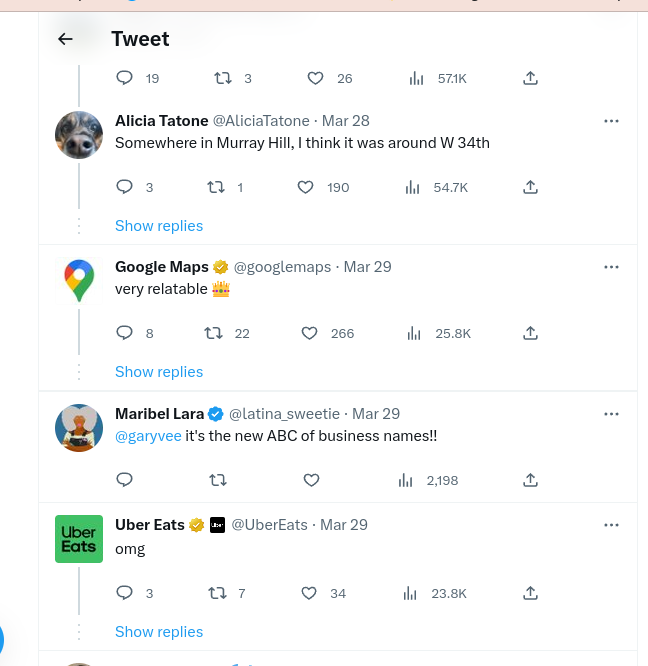


"We're all living in 2023, these guys are living in 3023.", Yelp



Local SEO Hacks


This restaurant is not alone on the list of people trying to hack the "Local SEO" rankings, but this tweet by @AliciaTatone made this one go viral.



A Thai restaurant in New York City has gained popularity on Twitter for its unique branding approach of naming itself "Thai Food Near Me," taking advantage of people's common search patterns on Google.

Being from Panama City, I see restaurants opening and closing with regularity. The restaurant business is tricky in a cosmopolitan city. It makes sense that you would try to capitalize on your clientele as fast as possible in this case. 

I do not think that name will make a long-lasting legacy in the traditional sense; if so, we will have everyone opening businesses with this strategy, but you never know how they may!

Read some of the comments below by Google Maps, Stella Artois, Yelp, Uber Eats, and many more:


Subscribe now for more articles like this. You'll get fresh ideas and practical advice you can use, in less than 3 minutes. Stay ahead of the curve!


